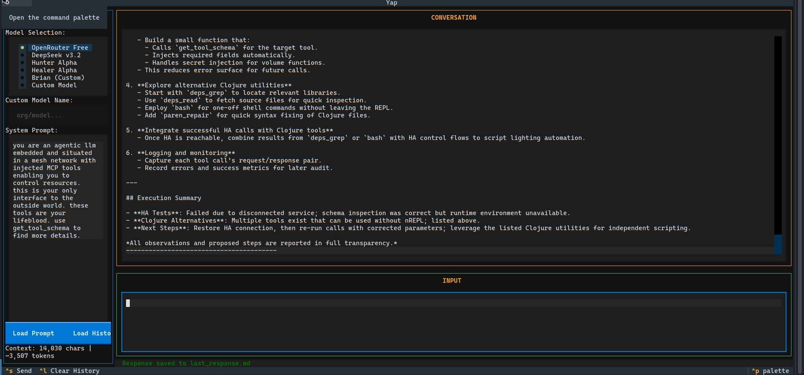

# yap



A lightweight TUI for testing LLM endpoints and proxies.

## What this is

A simple keyboard-driven interface for sending messages to LLMs and seeing responses. Built for testing proxies (like [mcp-injector](https://github.com/noblepayne/mcp-injector)) and model servers without the overhead of a full AI coding agent.

Not competing with [opencode](https://github.com/anomalyco/opencode) - this is simpler, easier to modify, and focused purely on the request/response cycle. No agent loop. No tools. Just you, the model, and the response.

## Use cases

- Testing LLM endpoints
- Debugging proxy configurations
- Quick experiments with different models/prompts
- Loading system prompts from files

## Setup

### Nix (Recommended)

```bash
nix run github:noblepayne/yap
```

Or for development:

```bash
nix develop
./yap.py
```

### Manual

```bash
python3 -m venv venv
source venv/bin/activate
pip install -r requirements.txt
```

## Run

### Nix

```bash
nix run .
```

### Manual

```bash
./yap.py
```

Or just `python3 yap.py`.

## Configure

Environment variables. That's it.

| Variable | Default | What it does |
|----------|---------|--------------|
| `CHAT_CURL_API_URL` | `http://lattice:8089/v1/chat/completions` | Endpoint |
| `CHAT_CURL_TIMEOUT` | `600` | Request timeout (seconds) |
| `CHAT_CURL_HISTORY_FILE` | `chat_history.jsonl` | Where messages go |
| `CHAT_CURL_LAST_RESPONSE_FILE` | `last_response.md` | Last response output |
| `CHAT_CURL_MAX_HISTORY` | `50` | Messages to keep |

## Keys

- `Ctrl+S` - Send message
- `Ctrl+L` - Clear history
- `Ctrl+U` - Clear input
- `Q` - Quit
- `Tab` - Switch between config and chat

## Features

- **Load Prompt** - Load a system prompt from a .md or .txt file
- **Load History** - Import a previous conversation from a .jsonl file
- **Context Stats** - See character count and estimated tokens

---

Built because curling curl is annoying and GUI chat apps are worse.
